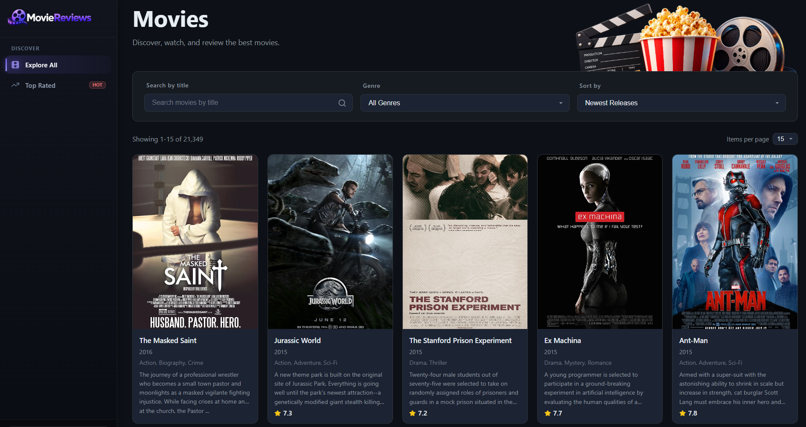
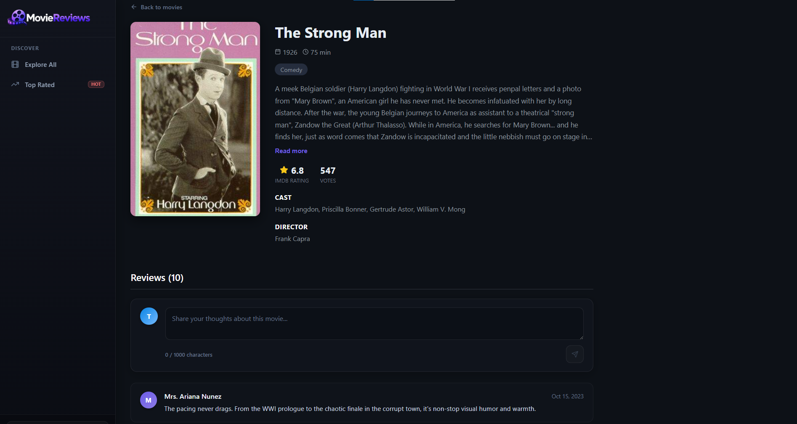

# Movie Reviews

A MERN application for discovering movies, filtering catalog data, viewing detailed metadata, and posting community reviews, built on top of MongoDB's public `sample_mflix` dataset. It uses a layered design that separates API routing, business logic, database access, and presentation. The server is a Node.js/Express REST API, and the client is a React SPA. 

It is built to handle large movie catalogs with fast client-side and server-side querying. Users can search by title, filter across genres, sort by release metrics, inspect production details, and write user reviews.








## Key Features

- **Catalog Search and Filtering:** 

    Dynamic query filtering across 21,000+ titles by title, genre, and sort criteria.
    
- **Server-Side Pagination:** 
    
    The server uses the `page` and `moviesPerPage` parameters to apply `skip` and `limit` to the MongoDB query, so the client receives only the requested slice of the catalog.

- **Detailed Metadata View:** 

    The detailed metadata view provides a comprehensive look at each movie, including release year, runtime, IMDb score, vote count, cast, and director credits.
    
- **Reviews:** 
    
    Logged-in users can submit reviews up to 1,000 characters. New reviews reload the movie data, edits update the local list, and the API checks the review id and user identity before allowing edits or deletion.


## API Endpoints

| Method | Endpoint | Description |
|---|---|---|
| GET | `/api/v1/movies/` | List movies with pagination, title, genre, and sort filters |
| GET | `/api/v1/movies/id/:id` | Get a movie and its reviews by `id` |
| GET | `/api/v1/movies/genres` | Get available movie genres |
| POST | `/api/v1/movies/reviews` | Create a review |
| PUT | `/api/v1/movies/reviews` | Update a review |
| DELETE | `/api/v1/movies/reviews` | Delete a review |

## Running it locally

You'll need Node 18+ and a MongoDB Atlas cluster loaded with the `sample_mflix` sample dataset (the free tier is enough).

**Server**

```bash
cd server
npm install
```

Create `server/.env`:

```
MOVIEREVIEWS_DB_URI=your-mongodb-atlas-connection-string
MOVIEREVIEWS_NS=sample_mflix
PORT=8000
```

```bash
node index.js
```

**Client**

```bash
cd client
npm install
```

Create `client/.env`:

```
REACT_APP_API_URL=http://localhost:8000
```

```bash
npm start
```

## License

This project is licensed under the [MIT](LICENSE) License.